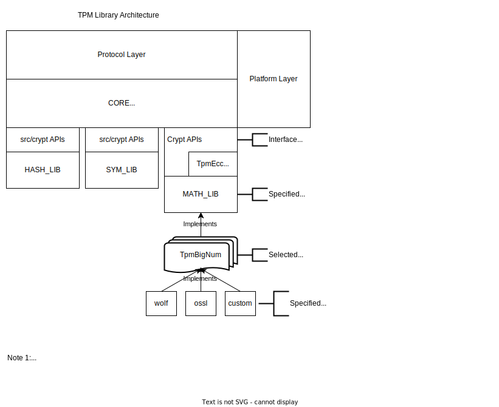

<!-- Copyright Microsoft Corporation. All Rights Reserved
     Licensed subject to: https://github.com/microsoft/ms-tpm-20-ref/blob/main/LICENSE -->

# TPM Reference Code - High Level Architecture

- [TPM Reference Code - High Level Architecture](#tpm-reference-code---high-level-architecture)
  - [See Also](#see-also)
  - [TPM code architecture and layering](#tpm-code-architecture-and-layering)
    - [Protocol Layer](#protocol-layer)
      - [Protocol Examples](#protocol-examples)
    - [Core Library](#core-library)
    - [Crypto Libraries](#crypto-libraries)
    - [Platform Library](#platform-library)
  - [Architecture Diagram](#architecture-diagram)

## See Also

- [Introduction](Introduction.md)
- [Library Architecture](Library.Architecture.md)
- [Tpm BigNum Library](Tpm.BigNum.Library.md)
- [Tpm Crypto Libraries](Tpm.Crypto.Libraries.md)
- [Tpm Math Library](Tpm.Math.Library.md)
- [Tpm Platform API](Tpm.Platform.Api.md)

## TPM code architecture and layering

A TPM Implementation consists of several layers, not all provided by the TPM
Reference Library. From the perspective of an outside caller into the TPM, the
layers are:

<!-- no toc -->
- [Protocol Layer](#protocol-layer)
  - [Protocol Examples](#protocol-examples)
- [Core Library](#core-library)
- [Crypto Libraries](#crypto-libraries)
- [Platform Library](#platform-library)

### Protocol Layer

The outermost, external layer.  This can implement any of the signaling
protocols described in various platform specs, or be entirely custom. Some
examples of the protocol layer are implementations of the Serial Peripheral
Interface (SPI) interconnect and Command Response Buffer definition from
[[8]](Introduction.md#references).  Other platform-specific TPM specifications
such as mobile or automotive scenarios will define this layer.

All code in this repository relating to the Protocol Layer is _INFORMATIVE_.

All protocol layers pass TPM commands into the Core Library via the
`ExecuteCommand` API. Protocol layers _MAY_ also manipulate limited TPM state
via other `Platform` API functions as defined in the [Platform
Layer](#platform-library) headers.

#### Protocol Examples
In this repository, the `TPMCmd/Simulator` folder provides a `Protocol Layer`
designed for test and development.  The Samples folder demonstrates other
possible implementations of the Protocol Layer.  The Samples folder has been
contributed over time by various sources and should be considered illustrative
only.  In particular, it is not regularly built and may not even compile at any
particular time.

### Core Library

This `Core` layer contains the bulk of the code that implements a TPM.  All of
the command parsing, data marshalling, access checks, and other primary
functionality is in this layer.  The _behavior_ (vis-a-vis the _implementation_)
of the `Core` layer of the Reference code contained in this repository is
_NORMATIVE_ for the TPM Specification.

### Crypto Libraries

The `Core` layer consumes cryptographic services from three
_implementation-defined_ crypto libraries.  These libraries are specified by
build flags as described in [TPM Crypto Libraries](Tpm.Crypto.Libraries.md).

The reference code supports OpenSSL as a placeholder library, with the intention
that an implementor can replace this functionality by providing an
implementation of the appropriate interface.

### Platform Library

The `Platform` library provides services to both the `Core` Layer as well as the
`Protocol` layer. Generally speaking, the platform layer provides operating
system services such as obtaining entropy, storing persistent (non-volatile)
data, etc.

In some implementations the Platform layer is also the communication
mechanism for the Protocol Layer to signal state to the Core Library. For
example, when implementing Locality, the Core layer will query the active
Locality via the Platform layer, not directly from the Protocol Layer, even
though it is frequently the protocol layer that is in control of locality.

The Core library requires the Platform library provide the interface defined by
`tpm_to_platform_interface.h`.

The Protocol and Platform Libraries are allowed to call the Core library on the
functions defined in `platform_to_tpm_interface.h`. The Core library is not
re-entrant or multithread safe.

See [Tpm Platform API](Tpm.Platform.Api.md) for more info.

## Architecture Diagram

<!-- created in https://app.diagrams.net/ -->

